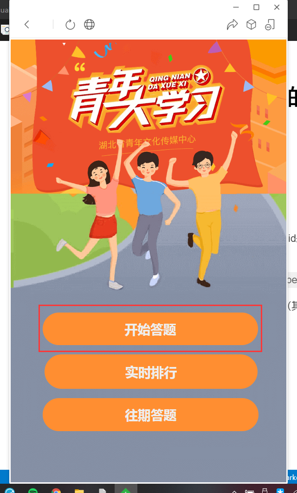

# 🎉 欢迎来到NoTeenStudy的使用指南

通过以下指导，你可以快速的配置NoTeenStudy的使用环境。

## 配置前准备

### 　1. openid的获取

  由于目前的技术原因，NoTeenStudy需要用户手动配置的openid来获取用户的信息以使用青年大学习相关功能。

> 如果你已经配置好了openid，请在`config.yml`中填写你的openid并[跳过此内容](#2.)。

  推荐使用电脑版微信进行抓包，下文以Fiddler Classic做演示（其他工具过程大多相同）。

1. 先打开微信并使用自带的浏览器查看青年大学习页面  

    同时启动Fiddler等待抓包，抓到的包会在Fiddler的“请求”栏中显示。

2. 点击下图所示按钮并查看Fiddler抓包状态
  
   

3. 在请求参数中找到你的openid

   

   数据包请求地址是:`api.fjg360.cn`，请求方式是:`GET`，请求参数是:`openid`。

   > 不排除你可以通过前后的几个相关数据包也可以抓取到openid的可能

4. 最后将openid粘贴至`config.yml`中的`openid`字段中
